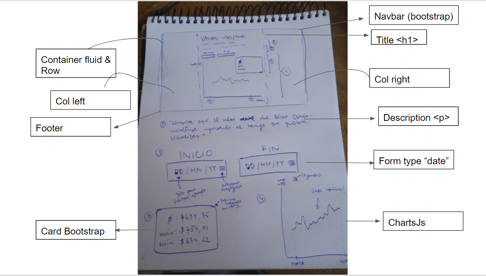

# SBIF Challenge!

**Duración del Sprint:** 
Viernes 05-06 al Martes 09-06-2020

**Objetivo del Sprint**:
Construir una aplicación web que permita obtener y visualizar el valor del dólar para un período de tiempo determinado, consultando a la API de la SBIF. La aplicación debe contar con lo siguiente:

## Requerimientos funcionales

-   :heavy_check_mark: Definir el rango de tiempo a consultar (fecha inicial y fecha final).
-   :heavy_check_mark: Invocar la API de la SBIF para obtener los valores del dólar.
-   :heavy_check_mark: Mostrar y visualizar en un gráfico los valores consultados para el rango de fechas.
-   :heavy_check_mark: Mostrar promedio, valor máximo y mínimo en el rango de fechas definido.
- :heavy_check_mark: El usuario debe poder acceder a través de una URL => [https://d2fsn0bshk955j.cloudfront.net/](https://d2fsn0bshk955j.cloudfront.net/). (Deploy en progreso de migración de host!)

## :computer: Stack tecnológico

Esta web app fue desarrollada utilizando las siguientes tecnologías / librerías
### Frontend:
 - React Js
 - TypeScript
 - Bootstrap (UI CSS Framework)
 - Lodash (Manejo óptimo de estructuras de datos)
 - Moment (Parseo de fechas)
 - Charts (Gráficos)
 - Axios (Http request)
 - Async Functions & Promises
 - Api de SBIF
### Backend:
- Amplify AWS CloudFront & S3

### Prototipo de baja fidelidad:

### :rainbow: Paleta de Colores

## :pencil: Herramienta de gestión de proyecto:

 -  [Github Project](https://github.com/betanyeli/sbif_challenge/projects/1)
 
## :bug: Issues :eyes:

-[Fix](https://github.com/betanyeli/sbif_challenge/issues)

## :collision: AWS CLOUDFRONT DEPLOY :collision:

- :warning: Asegúrate de tener una cuenta de AWS services  :warning:

- Ejecuta en la terminal `npm install -g @aws-amplify/cli`

-  `Amplify Configure` e inicia sesión en tu  cuenta de AWS 

- `Amplify Init` en la raíz de tu proyecto, para inicializarlo

- Ejecuta `Amplify add hosting`  para agregar el servicio de hosting.

- Select AWS CloudFront & S3 Bucket

- Select DEV option for HTTP or PROD for HTTPS.

- Ejecuta `Amplify publish`
